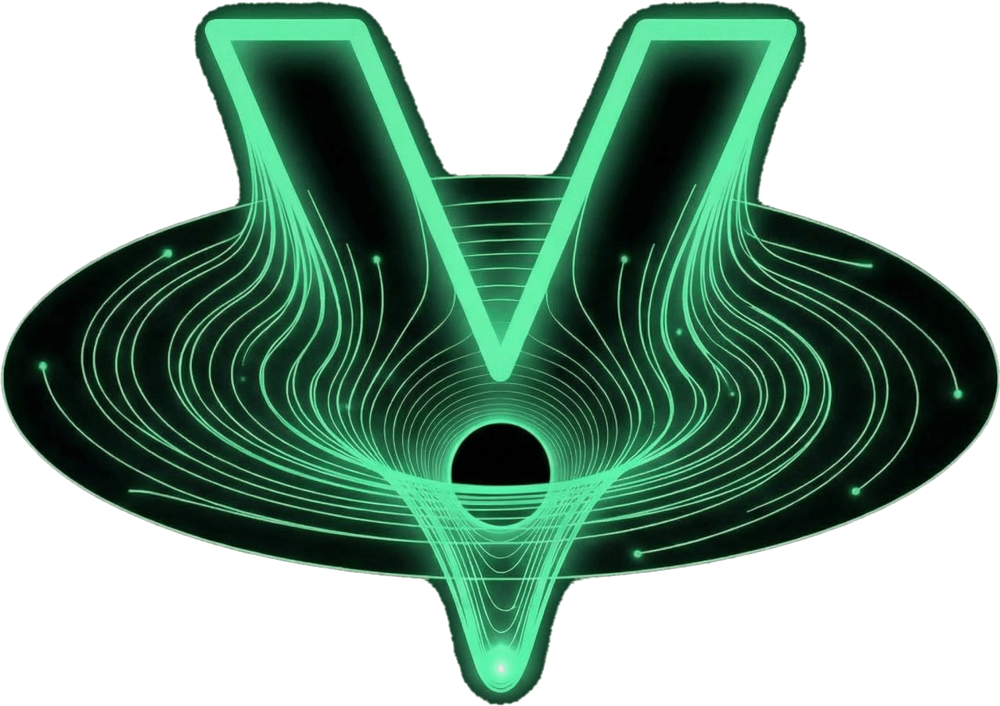

<div align="center">



# Voidspace

### The Intelligence Layer for NEAR Protocol

**Ecosystem intelligence · AI smart contract builder · Blockchain education**
**All in one platform. Built for builders.**

[](https://voidspace.io)
[](https://near.org)
[](.)
[](.)

---

### 🎬 Demo

https://github.com/user-attachments/assets/ef14e58b-3c15-484b-9f14-62f2a3111c26

</div>

---

## What is Voidspace?

Voidspace is a **full-stack intelligence platform** for the NEAR ecosystem. It combines real-time market data, on-chain analytics, AI-powered development tools, and structured education into a single application — giving builders everything they need to discover opportunities, write smart contracts, and ship products on NEAR.

There is nothing else like it in the NEAR ecosystem. Or any ecosystem.

**462 source files. 108,879 lines of TypeScript. 456 commits. 3 weeks. Zero templates. One developer.**

---

## 🔭 Observatory — Ecosystem Intelligence Dashboard

The Observatory is a real-time command center for the entire NEAR ecosystem.

- **20+ browsable categories** — DeFi, NFTs, Gaming, Infrastructure, Social, DAOs, and more
- **140+ indexed NEAR projects** with live market data powered by DexScreener
- **Category-level aggregate stats** — total TVL, volume, token counts per vertical
- **Top Movers & New Pairs** — surface trending tokens and freshly listed pairs
- **DeFi Overview Banner** — ecosystem-wide liquidity, volume, and market cap at a glance

Every project page includes live token price, 24h volume, liquidity depth, GitHub activity, and links to all relevant resources.

---

## 🫧 Void Bubbles — 3D Market Visualization

An interactive **Three.js-powered bubble field** rendering the NEAR token ecosystem in real time.

- Bubble size = market cap · Color = 24h price change · Animation = volume
- **Whale alert system** — detects and highlights large transactions as they happen
- **9-stat ribbon** — price, volume, market cap, liquidity, gainers, losers, pairs, and more
- **Fullscreen mode** with glassmorphism UI overlay
- Click any bubble to deep-dive into that token's full profile

Not a chart. Not a table. A living, breathing visualization of the NEAR economy.

---

## 🔍 Void Lens — Deep Wallet Intelligence

Paste any NEAR wallet address. Get a **complete behavioral profile**.

- **6-axis reputation score** — Activity, DeFi engagement, Governance, Development, Security, Age
- **Portfolio valuation** — every token balance × live USD pricing via DexScreener
- **DeFi position tracking** — staking, LP positions, lending, yield farming
- **Security profiling** — suspicious patterns, contract interactions, risk signals
- **Transaction history** with categorization and behavioral radar chart
- **Address suggestions** — validates and autocompletes known NEAR addresses

Think of it as a credit score for blockchain wallets — but transparent and verifiable.

---

## 🌌 Constellation Map — Transaction Flow Graph

A **D3.js force-directed graph** that maps relationships between wallets visually.

- Enter any wallet → see every wallet it has transacted with, rendered as a network graph
- **Directional arrows** showing fund flow (who sent to whom)
- **Cluster detection** — highlights wallet groups that transact frequently
- **Time & value filters** — narrow transactions to specific date ranges and amounts
- **Interactive controls** — zoom, pan, search, minimap, context menus on every node
- **Edge hover tooltips** — see transaction count, total value, and date range per connection
- **Type filter pills** — toggle visibility by transaction type (transfer, stake, contract call)
- **Screenshot export** — one click to save your graph as an image
- **Fullscreen mode** for presentations and deep analysis

Reveals patterns invisible in raw blockchain data. Who funds whom. Where the money flows.

---

## 🔮 Voids — AI Opportunity Detection

Voidspace doesn't just show you what exists — it shows you **what's missing**.

- Analyzes real ecosystem data to detect **gaps** in the NEAR landscape
- Each "Void" is a scored opportunity (0–100) based on demand signals, competitive density, and technical difficulty
- **Void Brief** — click any opportunity to generate a full AI build plan: architecture, tech stack, go-to-market strategy, competitive analysis, and estimated timeline
- Powered by cross-referencing project data, market signals, GitHub activity, and category coverage

This is how you find what to build next.

---

## ⚡ Sanctum — AI Smart Contract Development

**The world's first AI-powered IDE built specifically for NEAR and Rust smart contracts.**

This isn't a chatbot that writes code. It's a full development environment.

### 8 Specialist AI Personas

| Persona | Role | Specialty |
|---------|------|-----------|
| 🐧 **Shade** | Lead Architect | System design, architecture, orchestration |
| 🦀 **Oxide** | Rust Grandmaster | Language mastery, idioms, performance |
| 🛡️ **Warden** | Security Overlord | Audit, exploits, hardening |
| ⚡ **Phantom** | Gas & Performance | Optimization, gas profiling, efficiency |
| 🌉 **Nexus** | Cross-Chain | Bridges, interop, multi-chain patterns |
| 🎭 **Prism** | Frontend & Integration | dApp UI, wallet connection, SDK usage |
| 🧪 **Crucible** | Testing & QA | Test suites, fuzzing, simulation |
| 💰 **Ledger** | DeFi & Tokenomics | Financial contracts, token design, MEV |

### 3 Builder Modes

- **Learn** — Guided education. The AI teaches concepts step by step.
- **Build** — Project scaffolding. Describe what you want, get a working contract.
- **Expert** — Full control. Direct conversation with any specialist.

### Full Development Pipeline

- **Natural language → production Rust code** in real time
- **Scratch Mode** — start from pre-built contract templates (token, NFT, DAO, marketplace, staking, etc.)
- **Import & Iterate** — bring existing contracts for AI-assisted refactoring
- **Webapp Builder** — auto-generates a frontend dApp with wallet integration and method calls
- **Post-contract pipeline** — downloadable ZIP project scaffold, deploy instructions, simulation
- **Roast Zone** — security audit your contract ideas with brutal, honest feedback
- **Persistent projects** — save, revisit, and iterate on your work across sessions

Powered by **Claude Opus 4**. Credit-based usage across 4 subscription tiers.

---

## 📚 Learn — Structured Blockchain Education

**66 learning modules across 4 progressive tracks.**

| Track | Modules | Focus |
|-------|---------|-------|
| 🧭 **Explorer** | 16 | NEAR fundamentals, wallets, ecosystem orientation |
| 🔨 **Builder** | 22 | Rust, smart contracts, testing, deployment |
| 🗡️ **Hacker** | 16 | Security, exploits, auditing, hardening |
| 👑 **Founder** | 12 | Tokenomics, governance, go-to-market, fundraising |

### Plus:

- **Quick Start Guide** — zero to NEAR in minutes
- **7 Deep Dive articles** — Rust for Blockchain, NEAR vs Solana, Wallet Setup, Why Rust, Key Technologies, Rust Curriculum, For Solana Developers
- **Cross-chain content** targeting Solana and Ethereum developers exploring NEAR
- **Capstone projects** at the end of each track
- **Completion certificates** per track
- **Progress tracking** with streak system and module completion visualization

### 🌟 Skill Constellation

An **interactive star-map** that visualizes your learning progress across all 4 tracks. Each completed module lights up a star. Watch your constellation grow as you master NEAR development.

---

## 👤 Profile — Void Command Center

A mission-control-style dashboard for every user.

- **118 achievements** across exploration, learning, building, and community categories
- **XP system** with level progression tied to real platform activity
- **Arsenal** — saved opportunities, build plans, Sanctum projects, and bookmarks
- **Skill Constellation** embedded in your profile
- **Activity history** and engagement metrics

---

## 💰 Pricing

All intelligence tools are **free**. Only Sanctum (AI builder) is credit-gated.

| Tier | Price | Sanctum Credits | Highlights |
|------|-------|----------------|------------|
| **Shade** | Free ($2.50 one-time) | Limited | Full access to all intel tools + learning |
| **Specter** | $25/mo | Standard | All Sanctum personas, export, projects |
| **Legion** | $60/mo | High | Priority processing, advanced features |
| **Leviathan** | $200/mo | Unlimited | Enterprise support, maximum limits |

**Credit top-ups** ($5 / $20 / $50 / $100) available to all tiers. Credits never expire.

---

## 🏗️ Tech Stack

| Layer | Technology |
|-------|-----------|
| **Framework** | Next.js 15 (App Router, TypeScript, React 19) |
| **Styling** | Tailwind CSS 4, Framer Motion |
| **3D / Viz** | Three.js, D3.js, Recharts |
| **Database** | Supabase (PostgreSQL, Realtime, RLS) |
| **Auth** | NEAR WalletConnect (@hot-labs/near-connect) |
| **AI** | Anthropic Claude Opus 4 |
| **Market Data** | DexScreener API (real-time, 60s cache) |
| **Chain Data** | NearBlocks API (queued, rate-limit-safe) |
| **Ecosystem** | NEAR Catalog, DeFiLlama, GitHub API |
| **Payments** | Stripe (subscriptions + one-time top-ups) |
| **Hosting** | Vercel (Edge, ISR) |
| **SEO** | JSON-LD (Course, FAQ), dynamic OG images, sitemap |

---

## 📐 Architecture

```
src/
├── app/
│   ├── api/                  # 28 API routes (auth, AI, payments, sync, data)
│   ├── observatory/          # Ecosystem intelligence dashboard
│   ├── void-bubbles/         # Three.js 3D market visualization
│   ├── void-lens/            # Wallet reputation & portfolio analysis
│   ├── constellation/        # D3.js transaction flow mapping
│   ├── opportunities/        # AI opportunity detection + Void Briefs
│   ├── sanctum/              # AI development environment (60 files)
│   ├── learn/                # 66 modules, 4 tracks, 7 deep dives (121 files)
│   ├── pricing/              # Subscription tiers + Stripe checkout
│   ├── profile/              # Void Command Center + Skill Constellation
│   ├── projects/             # Individual project deep-dive pages
│   ├── categories/           # Category browsing with DeFi stats
│   ├── search/               # Full-text ecosystem search
│   └── legal/                # Terms, privacy, cookies, disclaimer
├── components/               # 136 shared UI components
├── contexts/                 # Wallet, achievements, theme, app state
├── hooks/                    # Custom React hooks
├── lib/                      # Business logic, data services, APIs
└── types/                    # TypeScript definitions
```

---

## 🚀 Getting Started

```bash
git clone https://github.com/AgentWarhead/Voidspace.git
cd Voidspace
npm install
cp .env.example .env.local
npm run dev
```

### Required Environment Variables

| Variable | Purpose |
|----------|---------|
| `NEXT_PUBLIC_SUPABASE_URL` | Supabase project URL |
| `NEXT_PUBLIC_SUPABASE_ANON_KEY` | Supabase public key |
| `SUPABASE_SERVICE_ROLE_KEY` | Supabase admin key |
| `ANTHROPIC_API_KEY` | Claude Opus 4 (Sanctum AI) |
| `STRIPE_SECRET_KEY` | Stripe payments |
| `STRIPE_WEBHOOK_SECRET` | Stripe webhook verification |
| `SYNC_API_KEY` | Data sync authentication |

---

## 🗺️ Roadmap

- [ ] Cloud WASM compilation — compile and test contracts in-browser
- [ ] One-click testnet deployment from Sanctum
- [ ] Community layer — share contracts, collaborate on Voids
- [ ] DAO tooling — governance analysis, treasury intelligence
- [ ] Sanctum marketplace — community contract templates
- [ ] Mobile app
- [ ] Multi-chain expansion beyond NEAR

---

## 📊 By the Numbers

| Metric | Value |
|--------|-------|
| Source files | 462 |
| Lines of TypeScript | 108,879 |
| UI Components | 136 |
| API Routes | 28 |
| Learning Modules | 66 |
| Achievements | 118 |
| AI Personas | 8 |
| Ecosystem Categories | 20+ |
| Git Commits | 456 |
| Build Time | 3 weeks |
| Developers | 1 |
| Templates Used | 0 |

---

## License

MIT — see [LICENSE](LICENSE) for details.

---

<div align="center">

**Built for the [NEARCON Innovation Sandbox](https://nearcon.org) by [Warhead](https://github.com/AgentWarhead) & [Urban Blazer](https://github.com/mfauch)**

*462 files. 108,879 lines. 3 weeks. One vision.*

**[voidspace.io](https://voidspace.io)**

</div>
